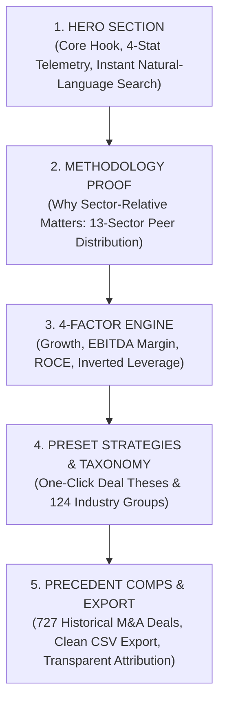

# 🧭 DealScope Positioning Memo: Strategy, Boundaries & Message Hierarchy

**Product:** DealScope (`dealscope-screener.vercel.app`)  
**Builder:** Ram (`ramsuthakaran.vp@gmail.com`)  
**Target Market:** M&A Associates, Corporate Development Analysts, Private Equity Deal Scouts, Investment Banking Analysts, Equity Research Associates  
**Positioning Locked:** Free, login-free acquisition screening workbench & comps tool for NSE-listed Indian equities

---

## 1. Current Positioning vs. Recommended Positioning

```
┌──────────────────────────────────────────────────────────────────────────────────────────┐
│                                   POSITIONING EVOLUTION                                  │
├─────────────────────────────────────────┬────────────────────────────────────────────────┤
│           CURRENT / PREVIOUS            │                   RECOMMENDED                  │
├─────────────────────────────────────────┼────────────────────────────────────────────────┤
│ "Institutional M&A & Equity Workbench"  │ "Free Listed-India Comps & M&A Screener"       │
│                                         │                                                │
│ Vague institutional cosplay claim       │ Clear, grounded, highly functional utility     │
│ Competes with $30,000/yr terminals      │ Bridges top-down screening & peer multiples    │
│ Generic retail vs institutional tropes  │ Respectful differentiation vs Screener.in      │
│ "Every company ranked like a deal team" │ "Every company scored within its sector the    │
│                                         │  way a deal team screens targets"              │
└─────────────────────────────────────────┴────────────────────────────────────────────────┘
```

---

## 2. Product Boundaries: What DealScope IS vs What It IS NOT

### What DealScope IS:
- **A specialized top-down M&A screening and comps workbench** covering 2,381 active NSE-listed companies.
- **A sector-relative percentile engine** across 13 calibrated sectors and 124 industry groups, normalizing operating performance so capital-intensive industrials aren't buried under asset-light IT.
- **A transparent peer valuation tool** calculating indicative P25 to P75 EV/EBITDA and P/E step-down equity valuation bands.
- **A deal telemetry monitor** providing instant visibility into promoter holdings, promoter pledge encumbrances (>10% warning chip), and estimated public float.
- **A searchable precedent transaction database** with 727 verified Indian M&A deals (2006–2025) categorized by sector.
- **A fast, client-side, zero-login, zero-paywall utility** with instant interactive filtering, custom weight sliders, and one-click CSV comps export.

### What DealScope IS NOT:
- ❌ **NOT PE deal origination or private company sourcing:** Covers NSE-listed equities only; does not claim proprietary off-market pipeline dealflow.
- ❌ **NOT a Bloomberg / Capital IQ / PitchBook killer:** Does not provide real-time ticking order book feeds, fixed income, FX, private markets diligence, or global equities.
- ❌ **NOT a Screener.in clone or replacement:** Screener.in is the gold standard for 10-year bottom-up financial statements and custom formulas. DealScope is built for top-down sector-relative screening and transaction comps.
- ❌ **NOT investment advice or a stock-tipping platform:** Does not provide buy/sell recommendations, price targets, or SEBI-registered advisory. Scores are deterministic empirical percentile calculations based on public filings.

---

## 3. Approved Positioning Phrases vs Strictly Banned Clichés

```
┌────────────────────────────────────────────────────────────────────────────────────────┐
│                               LANGUAGE GOVERNANCE TAXONOMY                             │
├────────────────────────────────────────┬───────────────────────────────────────────────┤
│            APPROVED PHRASES            │            STRICTLY BANNED PHRASES            │
├────────────────────────────────────────┼───────────────────────────────────────────────┤
│ • Sector-relative operating scores     │ • "Institutional-grade platform"              │
│ • Empirical quartile distributions     │ • "Bloomberg / CapIQ killer"                  │
│ • 13-sector peer normalization         │ • "AI deal origination engine"                │
│ • Listed-peer trading multiple ranges  │ • "Private company sourcing platform"         │
│ • Indicative EV/EBITDA & P/E bands     │ • "Stock recommendations / Tip sheet"         │
│ • Promoter pledge & float telemetry    │ • "Buy / Sell / Hold price targets"           │
│ • Precedent transaction context        │ • "Fair value / Intrinsic price"              │
│ • Dynamic weight re-normalization      │ • "SEBI-registered advisory"                  │
│ • Zero missing-data imputation         │ • "Next-gen AI investment platform"           │
│ • Free, login-free research workbench  │ • "Multibagger finder / Alpha screener"       │
│ • One-click CSV comps export           │ • "Quantitative Dossier" / "Deterministic Math"│
└────────────────────────────────────────┴───────────────────────────────────────────────┘
```

---

## 4. Master Homepage Message Hierarchy

A crisp, high-conversion 5-layer narrative flow:



### Layer 1: Above-the-Fold Hero
* **Kicker:** `FREE LISTED-INDIA COMPS & M&A SCREENER`
* **Wordmark:** `DEALSCOPE`
* **Headline:** `Every NSE-listed company, scored within its sector the way a deal team screens targets.`
* **Omnibar:** `Search 2,381 NSE companies or thesis (e.g. "TATA MOTORS", "high margin pharma", "low debt mid cap")...`
* **Primary Actions:** `[ Quantitative Filters ]` `[ View All 2,381 Equities ]`
* **Quick Sector Pills:** 13 direct sector toggle pills.
* **Telemetry Ribbon:** `2,381 NSE Equities • 727 Precedent Deals • 13 Sectors · 124 Industries • Zero Imputed Data`

### Layer 2: Section 01 / Sector Normalization
* **Header:** `01 / SECTOR NORMALIZATION`
* **Title:** `WHY SECTOR-RELATIVE SCORING MATTERS`
* **Core Argument:** Market-wide absolute cutoffs penalize cyclical, capital-intensive businesses. An 11% ROCE in auto components or manufacturing is top-decile performance, while an 11% ROCE in software is mediocre. DealScope scores companies strictly against their direct sector cohort.

### Layer 3: Section 02 / The 4-Factor Operating Engine
* **Header:** `02 / SCORING ARCHITECTURE`
* **Title:** `THE 4-FACTOR OPERATING ENGINE`
* **4 Factors:**
  1. **Revenue Growth (25%):** Top-line CAGR expansion relative to sector median.
  2. **EBITDA Margin (25%):** Operating profitability and cost discipline before non-cash & capital costs.
  3. **ROCE (25%):** Operating profit generated per rupee of capital employed.
  4. **Debt Health (25%):** Balance sheet safety via Net Debt to EBITDA. Financial Services exempted.
* **Dynamic Re-weighting:** Missing factors are dropped and surviving weights normalized, never scored as zero.

### Layer 4: Section 03 & 04 / Playbooks & Taxonomy
* **Header 03:** `03 / PRESET SCREENS` — `COMMON DEAL THESES` (High Quality Mid-Caps, Growth + Clean Balance Sheet, Cheap High ROCE Industrials, High Margin Pharma).
* **Header 04:** `04 / INDUSTRY TAXONOMY` — `13 SECTORS · 124 INDUSTRY GROUPS` (Empirical distribution curves for every industry).

### Layer 5: Section 05 & Footer / Comps & Authorship
* **Header 05:** `05 / TRANSACTION BENCHMARKS` — `727 PRECEDENT M&A DEALS (2006–2025)`
* **Footer:** `DEALSCOPE · Listed India M&A and Comps Workbench`
* **Builder Credit:** `Built by Ram` · [LinkedIn](https://www.linkedin.com/in/ramsuthakaran-vp-778b4731b/) · [Email](mailto:ramsuthakaran.vp@gmail.com) · `Free and public research tool. Not investment advice.`

---

## 5. Recruiter & Professional Audience Tone Guide

When an Investment Banking VP, Private Equity Associate, or Quant Recruiter reviews DealScope:

| What Gives an Amateur Impression | What Conveys Real Mastery |
| :--- | :--- |
| Over-hyped adjectives ("groundbreaking", "cutting-edge") | Understated, precise technical explanations |
| Pretending to be an enterprise terminal | Radical honesty: "Free, open, login-free workbench" |
| Claiming competitors "cheat with zeros" | Acknowledging market standards and defining your exact analytical niche |
| Calling EBITDA "cash conversion" | Accurately identifying EBITDA as operating profit before non-cash & capital costs |
| Obscure AI-generated filler ("delve", "tapestry", "underscores") | Direct, punchy, active sentences with exact figures |
| Em dashes on every line | Clean monospace punctuation (`·`, `/`, `:`) and balanced sentence rhythm |
